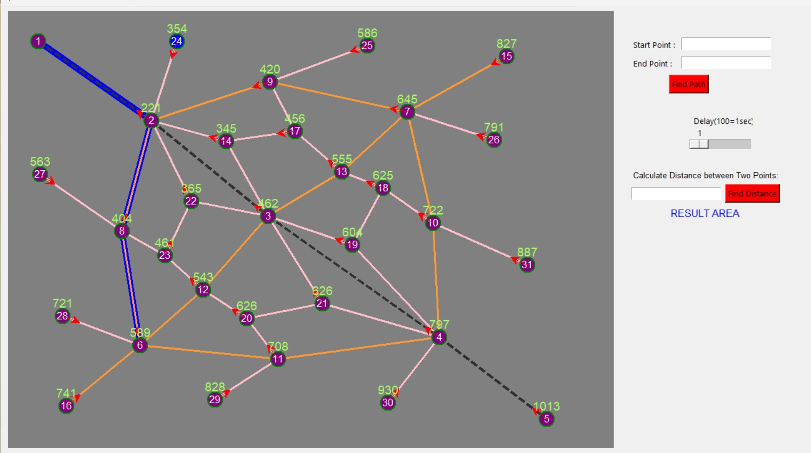

# Shortest Path Finder Using Dijkstra's Algorithm

This project is a **Python-based shortest path finder** that uses **Dijkstra's algorithm** to visually highlight the shortest route between two selected points on a graph. Built with the **Tkinter** library, it provides an interactive GUI where users can select start and end points, observe the algorithm in action, and control the speed of the visual representation.



## Features
- **Visual Representation**: Shows nodes and edges, highlighting the shortest path based on Dijkstra's algorithm.
- **Step-by-Step Animation**: Observe the algorithm in action with each step, as it calculates the shortest path.
- **Adjustable Speed**: Users can control the animation speed, allowing for a better understanding of the algorithm's workings.
- **Distance Calculation**: Calculate the distance between any two points in the graph.

## Technology Stack
- **Programming Language**: Python
- **GUI Library**: Tkinter

## How to Use
1. Enter the **Start Point** and **End Point** in the provided fields.
2. Click **Find Path** to visualize the shortest route.
3. Use the slider to adjust the **Delay** (speed of animation).
4. You can also calculate the distance between two points using the **Find Distance** button.

## Requirements
- Python 3.x
- **Tkinter** (usually comes pre-installed with Python, but can be installed separately if needed)

## Installation
1. Clone this repository:
   ```bash
   git clone https://github.com/Vikas-922/Shortest-path-finder-using-Dijkstra-s-algorithm---PYTHON-PROJ.git
